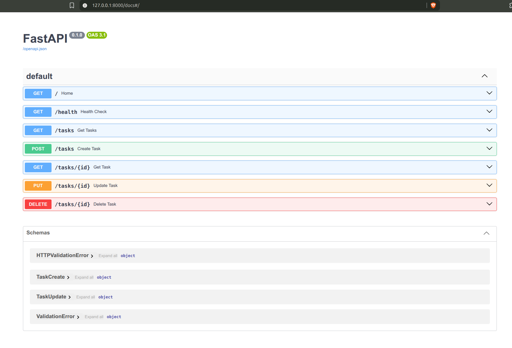
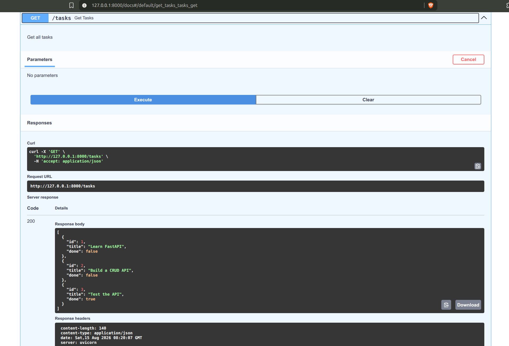
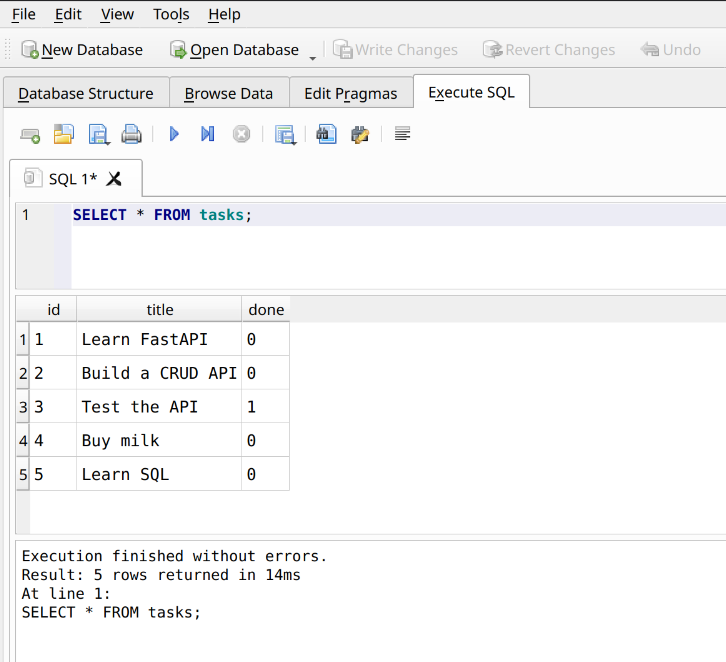

# Task API

A simple CRUD API built with Python and FastAPI for managing a to-do list.

This project was built as part of the FlyRank Backend Development Track.

The project was developed in two stages:
- **Assignment 1:** In-memory CRUD API
- **Assignment 2:** SQLite-backed CRUD API

## Features

- Create tasks
- Read all tasks
- Read a single task
- Update tasks
- Delete tasks
- Input validation
- HTTP status codes
- Interactive Swagger UI documentation
- SQLite database persistence

## Tech Stack

- Python
- FastAPI
- Uvicorn
- Pydantic
- SQLite

# Assignment 1 — In-Memory CRUD API

The first version of the API stored tasks in a Python list in memory.

## Swagger UI

FastAPI automatically provides interactive API documentation.

Open:

http://localhost:8000/docs

### Swagger Overview



### GET /tasks Example



## API Endpoints

| Method | Endpoint | Description |
|---|---|---|
| GET | `/` | Returns information about the API |
| GET | `/health` | Checks whether the server is running |
| GET | `/tasks` | Returns all tasks |
| GET | `/tasks/{id}` | Returns a single task |
| POST | `/tasks` | Creates a new task |
| PUT | `/tasks/{id}` | Updates an existing task |
| DELETE | `/tasks/{id}` | Deletes a task |

## Example

### Create a task

```bash
curl -i -X POST http://localhost:8000/tasks \
-H "Content-Type: application/json" \
-d '{"title":"Buy milk"}'
```

Example response:

```text
HTTP/1.1 201 Created
content-type: application/json

{"id":4,"title":"Buy milk","done":false}
```

### Get all tasks

```bash
curl -i http://localhost:8000/tasks
```

### Update a task

```bash
curl -i -X PUT http://localhost:8000/tasks/4 \
-H "Content-Type: application/json" \
-d '{"done":true}'
```

### Delete a task

```bash
curl -i -X DELETE http://localhost:8000/tasks/4
```

## Status Codes

| Status Code | Meaning |
|---|---|
| 200 | Request successful |
| 201 | Task created |
| 204 | Task deleted successfully |
| 400 | Invalid request |
| 404 | Task not found |

# Assignment 2 — SQLite Database

Assignment 2 replaces the in-memory Python list with SQLite while keeping the same CRUD API.

## Why SQLite?

SQLite was chosen because it:

- Stores the database in a single file
- Requires no separate database server
- Requires zero additional database setup
- Survives application restarts

The API and database both work with the same `tasks.db` file, so changes made to the database are immediately reflected by the API.

## Database

The database file is:

```text
tasks.db
```

It is stored in the project root and is created automatically when the application starts.

The file is included in `.gitignore`, so it is not committed to Git. Each fresh clone creates its own `tasks.db` with the table and three seeded example tasks.

## Getting Started

### 1. Clone the repository

```bash
git clone https://github.com/priyajitbiswal/task-api.git
cd task-api
```

### 2. Install dependencies

This project uses the dependencies defined in `pyproject.toml`.

If you are using `uv`:

```bash
uv sync
```

### 3. Start the server

```bash
uv run uvicorn main:app --reload
```

The API will be available at:

http://localhost:8000

No manual database setup is required. If `tasks.db` does not exist, the application automatically creates the database, creates the `tasks` table, and inserts the three example tasks.

## SQLite Database Screenshot



## SQLite Exploration

Example SQL query run in DB Browser for SQLite:

```sql
SELECT * FROM tasks;
```

This query returned all tasks currently stored in the SQLite database.

## Data Persistence

Unlike the first assignment, tasks are now stored in SQLite rather than only in application memory. Created, updated, and deleted tasks persist when the FastAPI server is stopped and restarted.

## Project Structure

```text
task-api/
├── main.py
├── README.md
├── screenshots/
│   ├── swagger-overview.png
│   ├── swagger-get-tasks.png
│   └── sqlite3-db-query.png
├── pyproject.toml
├── uv.lock
└── .gitignore
```

## Author

Priyajit Biswal
